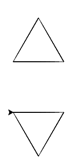

# Les 3b

## 1) Maak twee spirografen

Deze les wordt afgetekend als:

* Je twee spirograaffiguren naast elkaar hebt getekend

.png>)

Denk aan deze tips:

* Vergeet de dubbele punt : niet aan het einde van de `for`
* Doe de pen omhoog met `pen.penup()` tussen de figuren in
* Beweeg dan met `pen.forward(100)`
* Doe dan de pen weer omlaag met `pen.pendown()`

## 2) Maak twee driehoeken op elkaar

Deze les wordt afgetekend als:

* Je twee driehoeken onder elkaar hebt getekend

 (2) (2) (2) (2) (2) (1) (1).png>)

## 3) Maak twee vierkanten, eentje kleiner

Deze les wordt afgetekend als:

* Je twee vierkanten naast elkaar hebt getekend
* De tweede half zo groot is als de eerste

 (2) (2) (2) (1).png>)

## 4) Maak twee driehoeken op elkaar, eentje ondersteboven

Deze les wordt afgetekend als:

* Je twee driehoeken onder elkaar hebt getekend
* Eentje moet andersom zijn, zo:

## Extra) Teken een eigen figuur

Deze opdracht kun je zo vaak doen als je wilt. De opdracht gaat zo:

1. Je tekent een figuur in je schrift, het mag ieder figuur zijn dat minstens uit 2 delen bestaat.
2. Dit figuur laat je aftekenen (doe een gele post-it op je scherm).
3. Nu maak je de code voor het figuur.

Let op! Het telt alleen als je eerst tekent en dan pas code maakt!
