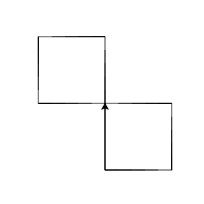

# Les 4a

## Lussen en variabelen
Aan het einde van de les kun jij:
* Dat variabelen ook getallen kunnen zijn
* Hoe we variabelen gebruiken bij het tekenen
* Hoe we variabelen gebruiken samen met lussen

### Even opfrissen
1\) Wat tekenen deze codes?
Let op! De codes kunnen ook fout zijn! Schrijf dan FOUT.

```python
1.
for i in range(3):
  pen.forward(100)
  pen.left(120)
```

```python
2.
for i in range(5)
  pen.forward(100)
  pen.left(60)
```

```python
3.
for i in range(3):
pen.forward(100)
pen.left(90)
```

```python
4.
for i in range(5):
  pen.forward(100)
  pen.left(45)
```

2\) Welke codes horen bij deze tekeningen?
1.


2.



### Variabelen in een lus
1\) Wat tekenen deze codes?

```python
1.
aantal_keer = 4
for i in range(aantal_keer):
  pen.forward(100)
  pen.left(90)
```

```python
2.
hoek = 120
for i in range(3):
  pen.forward(100)
  pen.left(hoek)
```

```python
3.
aantal_keer = 6
grootte = 100
for i in range(aantal_keer):
  pen.forward(grootte)
  pen.left(60)
```

```python
4.
aantal_keer = 6
hoek = 60
for i in range(aantal_keer):
  pen.forward(50)
  pen.left(hoek)
```

```python
5.
aantal_keer = 3
hoek = 60
for i in range(aantal_keer):
  pen.forward(50)
  pen.left(hoek)
```

```python
6.
aantal_hoeken = 8
hoek = 360/aantal_hoeken
for i in range(aantal_hoeken):
  pen.forward(50)
  pen.left(hoek)
```

7. Leg nu in woorden uit wat de code van code 6 \(hier direct boven\) doet.

```python
8.
namen = 3
for i in range(namen):
  print('Hallo')
```

```python
9.
namen = 3
klas = '1c'
for i in range(namen):
  print('Hallo', klas)
```

```python
10.
namen = 3
groet = 'Goedemorgen'
klas = '1c'
for i in range(namen):
  print(groet, klas)
```

2\) Wat tekenen deze codes? Let op: Er kunnen nu ook foutjes in de codes zitten!

```python
1.
aantal_keer = 4
for i in range(aantal_keer)
  pen.forward(100)
  pen.left(90)
```

```python
2.
aantal_keer = 4
for i in range(aantal_hoeken)
  pen.forward(100)
  pen.left(90)
```

```python
3.
aantal_keer = 6
grootte = 100
for i in range(4):
  pen.forward(100)
  pen.left(60)
```

```python
4.
aantal_keer = 5
hoek = 72
for i in range(aantal_keer):
  pen.forward(100)
  pen.left(hoek)
```

```python
5.
aantal_hoeken = 8
hoek = 360/aantal_hoeken   # / betekent gedeeld door in Python
for i in range(aantal_hoeken):
pen.forward(50)
pen.left(hoek)
```

```python
6.
aantal_keer = 3
hoek = 60
for i in range(aantal_keer):
  pen.forward(50)
  pen.left(hoek)
```

7. Leg in woorden uit wat de code van opdracht 6 doet.

```python
8.
namen = 3
klas = '1c'
for i in range(klas):
print('Hallo', klas)
```

 3\) Wat tekenen deze codes? 

```python
1.
hoeken = 3
for i in range(hoeken):
  pen.forward(100)
  pen.left(120)

pen.forward(100)

for i in range(hoeken):
  pen.forward(100)
  pen.left(120)
```

```python
2.
grootte = 100
for i in range(4):
  pen.forward(grootte)
  pen.left(90)

pen.penup()
pen.forward(grootte)
pen.pendown()

for i in range(4):
  pen.forward(grootte)
  pen.left(90)
```

```python
3. (Ja deze code is echt anders dan de code van 2 hoor. Kijk goed!)
grootte = 100
for i in range(3):
  pen.forward(grootte)
  pen.left(120)

pen.penup()
pen.forward(grootte/2)   # / betekent gedeeld door in Python
pen.pendown()

for i in range(3):
  pen.forward(grootte)
  pen.left(120)
```

```python
4.
grootte = 100
for i in range(6):
  pen.forward(grootte)
  pen.left(60)

pen.penup()
pen.forward(grootte)
pen.pendown()

grootte = 50

for i in range(3):
  pen.forward(grootte)
  pen.left(120)
```