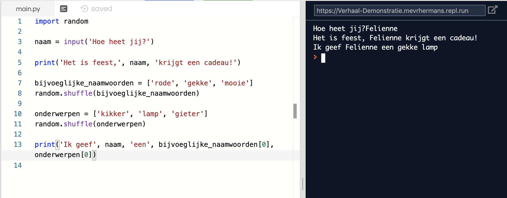

# Handleiding Nederlands

## Instructie voor de leerkracht

Het idee van deze module is dat leerlingen een interactief verhaal maken met Python. Leerlingen kiezen zelf een hoofdfiguur en een aantal gebeurtenissen die plaats kunnen vinden. Op aangewezen moment kan de lezer van het verhaal keuzes maken over de afloop. Leerlingen die snel door het materiaal gaat, maken ook gebruik van willekeurige keuzes in het verhaal.

## Doelen van deze module

In deze lessenserie komen de volgende leerdoelen aan bod:

1. printen, ook meerdere regels 
2. meerdere woorden printen met komma's
3. woorden opslaan in een variabele
4. opslaan in een lijst
5. aanwijzen in een lijst
6. een random getal kiezen \(en evt. ook ophalen uit de lijst\)
7. een random woord uit een lijst halen
8. invoer 
9. condities \(evt. als extra voor snelle lln\) 

## Voorbeeld

Op deze link staat een voorbeeld: [https://repl.it/@mevrHermans/Verhaal-Demonstratie](https://repl.it/@mevrHermans/Verhaal-Demonstratie)

Probeer dit zelf voor de les al even uit. Je ziet dat de lezer van het verhaal naar hun naam gevraagd wordt, en dat er dan steeds een ander zinnetje in beeld komt.

## Opzet van de lessen

Iedere module bestaat steeds uit twee delen: a en b

a\) Klassikale les met slides, en werkbladen deel a om in de klassikale les te maken   
b\) Werkbladen zodat lln zelf aan de slag kunnen achter de computer

## Slides

* [Module Nederlands, les 1](https://slides.com/felienne/pidk-m1-l1a)
* [Module Nederlands, les 2](https://slides.com/felienne/pidk-m1-l2a)
* [Module Nederlands, les 3](https://slides.com/felienne/pidk-m1-l3a)
* [Module Nederlands, les 4](https://slides.com/felienne/pidk-m1-l4a)
* [Module Nederlands, les 5](https://slides.com/felienne/pidk-m1-l5a)
* [Module Nederlands, les 6](https://slides.com/felienne/pidk-m1-l6a)

## Nakijkmodellen en proefwerken

We hebben ook nakijkmodellen en proefwerken voor de werkbladen a maar die zetten we liever niet openbaar op internet, wie weet dat een leerling ze vindt. Heb je ze nodig, neem even contact met ons op: f.f.j.hermans@liacs.leidenuniv.nl

